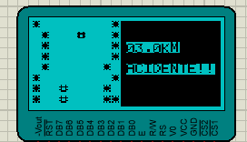
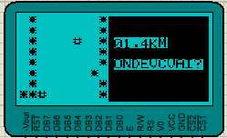
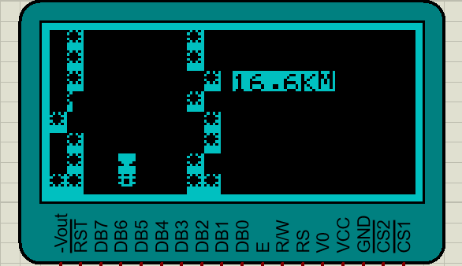
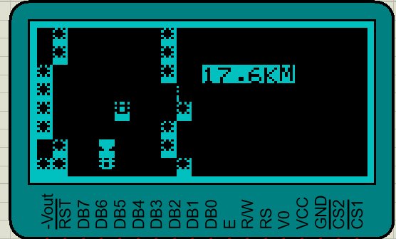
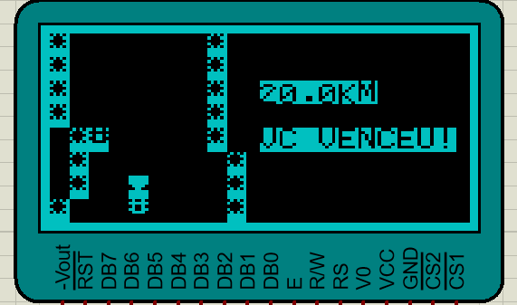

# Stock-Car-8952

Este projeto implementa um jogo de Stock Car em linguagem C para microcontroladores 8952, com exibição gráfica utilizando um display gráfico LCD (GLCD) compatível com o controlador KS0108.

O jogador controla um carrinho que percorre uma pista e precisa desviar de veículos inimigos e bordas da estrada. À medida que a distância aumenta, um modo "túnel" é ativado, reduzindo a visibilidade e introduzindo um novo desafio ao jogador.

## 🔧 Tecnologias Utilizadas

- Microcontrolador **8952** (ex: AT89S52)
- Display gráfico **GLCD KS0108**
- Linguagem **C**
- Simulação via **Proteus** e compilação via **Keil uVision**

---

## 🎮 Funcionalidades

- **Movimentação do carrinho**: O jogador pode mover o carrinho para esquerda e direita utilizando botões físicos (mapeados em P3.2 e P3.3).
- **Detecção de colisões**: O jogo termina se o carrinho colidir com as bordas da pista ou com outro veículo.
- **Pontuação por distância**: A distância percorrida é contada em km e exibida no visor.
- **Modo Túnel**:
  - Ativado ao atingir 15.0 km.
  - Diminui a visibilidade: a tela escurece e os carros inimigos ficam invisíveis fora do cone de luz.
  - Um **farol** aparece à frente do carro, revelando apenas inimigos que estão no feixe de luz.
- **Vitória**: O jogo é vencido ao atingir 20 km sem colisões.

---

## 🧠 Estrutura do Código

- **GLYPHS**: matriz com os caracteres personalizados (como o carrinho, pista, borda, farol, etc).
- **LETRAS / NUMEROS**: caracteres usados para formar mensagens como “ACIDENTE!!” e “VC VENCEU!”.
- **Funções principais**:
  - `generateNewLine()`: Gera a próxima linha da pista com base em uma seed pseudoaleatória.
  - `redrawTrack()`: Atualiza o display com as 8 linhas visíveis, incluindo o carrinho do jogador e efeitos do túnel.
  - `checkCollision()`: Verifica se houve colisão.
  - `drawScore()`: Exibe a pontuação em km no canto superior direito do display.
  - `vitoriaScreen()` e `gameOverScreen()`: Exibem as telas de fim de jogo.

---

## 📷 Exemplos de Execução

### ☠️ Tela de Game Over - Colisão com veículo

### 🚧 Tela de Game Over - Colisão com as bordas da pista

### 🌑 Tela ao entrar no túnel sem visibilidade

### 🔦 Tela quando os carros entram no feixe de luz do farol

### 🏁 Tela de vitória

---

## 🚀 Como Rodar

1. Conecte o microcontrolador ao GLCD KS0108 conforme o mapeamento dos pinos.
2. Compile o código em um ambiente compatível com 8052 (como o **Keil**) para gerar o .hex.
3. Grave o código em um AT89S52 real ou simule em software como **Proteus**.
4. Utilize dois botões físicos conectados aos pinos P3.2 (esquerda) e P3.3 (direita) para controlar o carro.
5. Evite colisões, sobreviva ao túnel e vença a corrida!

---

## 📁 Estrutura dos Arquivos

- `main.c`: Código-fonte completo do jogo.
- `README.md`: Este arquivo de explicação.
- `imagens/`: Pasta dos prints das telas de execução.

---